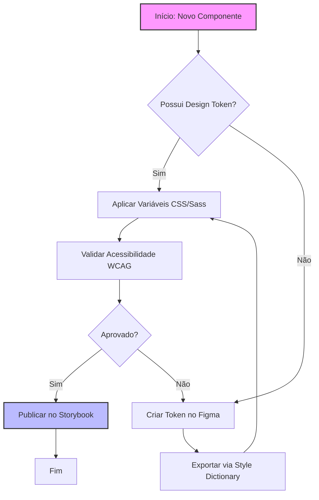
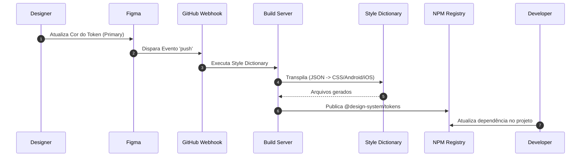

# 🎨 Teste Avançado de Plugin de Design

Este documento serve como uma suíte de testes robusta para validar a renderização de componentes, tipografia, diagramas complexos e equações matemáticas por plugins de design.

---

## 🧮 1. Renderização Matemática (LaTeX)

Testa o alinhamento, tamanho da fonte e suporte a símbolos matemáticos complexos.

### Equação em Bloco (Centralizada)

Abaixo está a definição da **Distribuição Normal** e uma identidade de cálculo integral:

\[f(x) = \frac{1}{\sigma \sqrt{2\pi}} e^{-\frac{1}{2}\left(\frac{x-\mu}{\sigma}\right)^2}\]

\[\int\_{-\infty}^{\infty} e^{-x^2} dx = \sqrt{\pi}\]

### Matriz de Transformação Espacial (Design 3D/Camadas)

Usada para calcular rotação e escala em engines de design:

\[\mathbf{T} = \begin{bmatrix} \cos\theta & -\sin\theta & t_x \\ \sin\theta & \cos\theta & t_y \\ 0 & 0 & 1 \end{bmatrix}\]

### Equação Inline

O Teorema de Pitágoras a² + b² = c² deve alinhar perfeitamente com o texto corrente, assim como o limite \(\lim\_{x \to \infty} \frac{1}{x} = 0\).

---

## 📊 2. Diagramas Estruturados (Mermaid.js)

Valida a capacidade do plugin de transformar sintaxe de texto em diagramas visuais e formas geométricas.

### A. Fluxograma de Decisão (Pipeline de Design System)

### B. Diagrama de Sequência (Sincronização de Tokens)

---

## 📋 3. Tabela de Design Tokens Expandida

Testa a densidade de dados, alinhamento de colunas, renderização de blocos de código inline e bordas de tabelas com múltiplos tipos de tokens (Cores, Espaçamento, Tipografia, Sombras).

| Categoria      | Nome do Token (`Token ID`) | Valor Nominal                | Tipo de Output | Exemplo Visual |
| :------------- | :------------------------- | :--------------------------- | :------------- | :------------: |
| **Color**      | `--sys-color-primary`      | `#6200EE`                    | HEX (Color)    |     `[🟣]`     |
| **Color**      | `--sys-color-success`      | `#03DAC6`                    | HEX (Color)    |     `[🟢]`     |
| **Spacing**    | `--sys-space-xs`           | `4px`                        | Rem / Px       |      `▪️`      |
| **Spacing**    | `--sys-space-md`           | `16px`                       | Rem / Px       |      `◼️`      |
| **Spacing**    | `--sys-space-xl`           | `32px`                       | Rem / Px       |      `⬛`      |
| **Typography** | `--sys-font-size-h1`       | `2.5rem (40px)`              | Font Size      |     **Aa**     |
| **Typography** | `--sys-font-weight-bold`   | `700`                        | Font Weight    |    **Bold**    |
| **Elevation**  | `--sys-shadow-depth-1`     | `0 2px 4px rgba(0,0,0,0.1)`  | Box Shadow     |    _Suave_     |
| **Elevation**  | `--sys-shadow-depth-3`     | `0 8px 16px rgba(0,0,0,0.2)` | Box Shadow     |   _Intenso_    |

---

## 📝 4. Elementos Interativos e Callouts

### Checklist de Homologação de Layout

- [x] Contraste de cor validado (mínimo 4.5:1 para texto normal)
- [x] Fontes carregam corretamente sem FOIT (_Flash of Unstyled Text_)
- [ ] Testado em modo escuro (_Dark Mode_)
- [ ] Responsividade validada de 320px até 1920px

> 💡 **Nota de Design System:**
> Todos os tokens de elevação (sombras) devem seguir rigorosamente o comportamento da luz vinda do topo (eixo Y positivo desproporcional ao eixo X).
